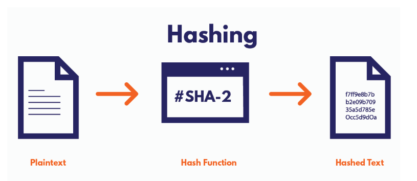
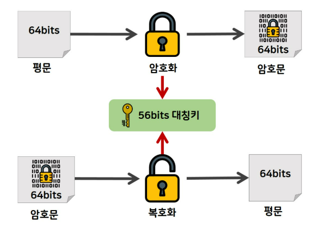
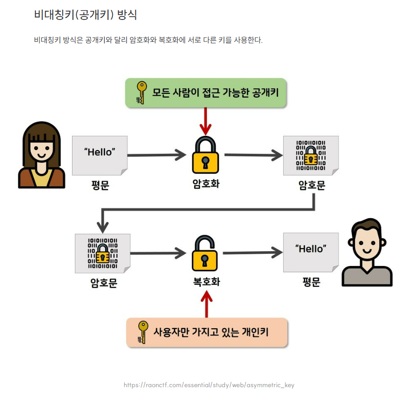

# < 자료보호와 암호화 기술의 원리 >

> 자료보호와 암호화 기술의 원리
> · 해싱/대칭/비대칭 암호화 알고리즘 정리

---

## 1. 암호화와 복호화란?

- **암호화(Encryption)**: 데이터를 암호 알고리즘과 키를 통해 인가되지 않은 사용자가 알아볼 수 없는 형태로 바꾸는 과정
- **복호화(Decryption)**: 암호문을 원래의 평문(Plaintext)으로 되돌리는 과정

- **정보보안 4대 목표**

  - 기밀성(Confidentiality)
  - 무결성(Integrity)
  - 인증(Authentication)
  - 부인방지(Non-repudiation)

- **활용 예시**
  - 메신저 종단간 암호화 (End-to-End Encryption)
  - 공공기관 문서 제출 시 전자서명
  - HTTPS 보안 통신

---

## 2. 해싱 (Hashing)

- **정의**  
  해싱은 임의의 길이의 데이터를 고정된 길이의 해시값으로 변환하는 함수.
  복호화가 불가능한 단방향 알고리즘이며, 무결성 검증과 인증에 활용.

- **특징**

  - 단방향 변환: 복호화가 불가능
  - 충돌 저항성: 서로 다른 데이터는 다른 해시값을 가져야 함
  - 결정성: 같은 입력 → 같은 해시 출력

- **활용 예시**

  - 비밀번호 저장 (SHA-256 + salt)
  - 블록체인 블록 연결
  - 파일 무결성 검증 (다운로드 파일 SHA 체크)

- **대표 알고리즘**

  - MD5 (보안성 낮음)
  - SHA-1 (현재는 권장하지 않음)
  - SHA-256 (현재 가장 널리 쓰임)

- **해시 함수 구조**

  

  해시 알고리즘이 입력값을 받아 고정된 해시값으로 변환하는 과정  
  조금만 입력이 달라져도 완전히 다른 해시값이 생성.

---

## 3. 대칭키 암호화 (Symmetric Encryption)

- **정의**  
  암호화와 복호화에 **동일한 키**를 사용하는 방식.

- **특징**

  - 키를 사전에 공유해야 함 → 키 유출 시 전체 보안이 위험
  - 속도가 빠르며, 대용량 암호화에 적합
  - 실제 서비스에서는 대칭+비대칭 혼합 구조로 많이 사용됨

- **암호화 모드**

  - ECB: 보안 취약 (패턴 노출)
  - CBC, GCM: 보안 강화된 블록 암호화 모드

- **대표 알고리즘**

  - AES: 현대 암호화 표준
  - DES, 3DES: 과거 사용, 현재는 취약
  - RC4: 스트림 방식, 현재는 거의 사용 안 함

- **활용 예시**

  - 압축파일(.zip) 비밀번호 설정
  - VPN 보안 통신
  - 하드디스크/DB 암호화

- **대칭키 암호화 구조**

  

  송신자와 수신자가 같은 키를 가지고 있어야 안전하게 통신 가능.

---

## 4. 비대칭키 암호화 (Asymmetric Encryption)

- **정의**  
  서로 다른 키 쌍(공개키, 개인키)을 사용하는 암호화 방식.
  하나로 암호화하면 오직 짝이 되는 다른 하나로만 복호화 가능.

- **특징**

  - **공개키**는 누구나 접근 가능, 암호화에 사용
  - **개인키**는 본인만 보관, 복호화 및 서명에 사용
  - 속도는 느리지만 **전자서명, 인증, 키 교환**에 매우 적합

- **전자서명**

  - 개인키로 서명 → 공개키로 검증
  - 위변조 방지 + 부인 방지 기능

- **대표 알고리즘**

  - RSA (가장 널리 사용)
  - ECC (짧은 키로 높은 보안)
  - DSA (전자서명 전용)

- **활용 예시**

  - HTTPS 인증서 → 공개키 기반
  - 암호화폐 지갑/서명
  - 공공기관 GPKI 인증 시스템

- **비대칭 암호화 구조**

  

  공개키로 암호화하고, 대응되는 개인키로만 복호화하는 비대칭 구조.

---

## 5. 알고리즘 비교 요약

| 항목          | 해싱               | 대칭키 암호화     | 비대칭키 암호화    |
| ------------- | ------------------ | ----------------- | ------------------ |
| 키 사용       | ❌ 없음            | ✅ 동일한 키 사용 | ✅ 공개키 / 개인키 |
| 복호화 가능   | ❌ 불가능 (단방향) | ✅ 가능 (양방향)  | ✅ 가능 (양방향)   |
| 처리 속도     | 매우 빠름          | 빠름              | 느림               |
| 보안 수준     | 중간               | 높음              | 매우 높음          |
| 용도          | 무결성, 해시저장   | 데이터 전송/저장  | 인증, 키교환, 서명 |
| 대표 알고리즘 | SHA-256, MD5       | AES, DES, RC4     | RSA, ECC, DSA      |

---

## 6. 활용 시나리오 정리

| 활용 상황              | 사용 기술          | 이유                                   |
| ---------------------- | ------------------ | -------------------------------------- |
| 로그인 비밀번호 저장   | 해싱               | 복호화 불가, 유출 시에도 위험 낮음     |
| 문서 암호화            | 대칭키 암호화      | 빠르고 강력한 보안 제공                |
| 웹사이트 HTTPS 접속    | 비대칭 + 대칭 혼합 | 인증은 비대칭, 데이터 전송은 대칭 사용 |
| 블록체인 트랜잭션 서명 | 해싱 + 전자서명    | 무결성과 부인 방지 동시에 달성         |
| 전자계약/서류 제출     | 비대칭키 + 서명    | 신원 인증 및 위변조 방지 목적          |

---
